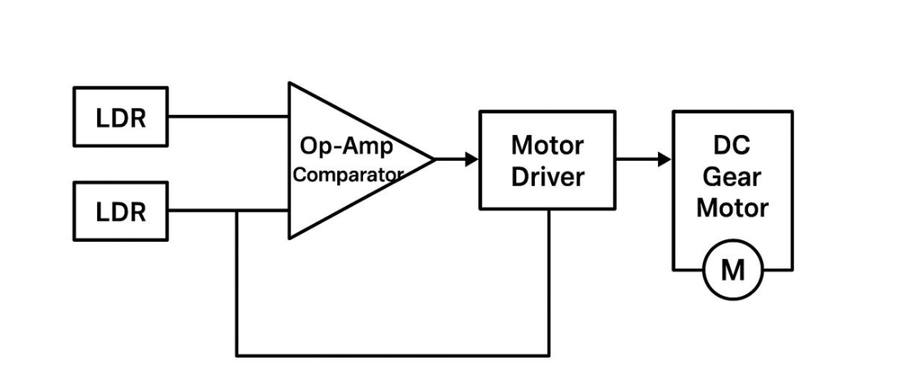
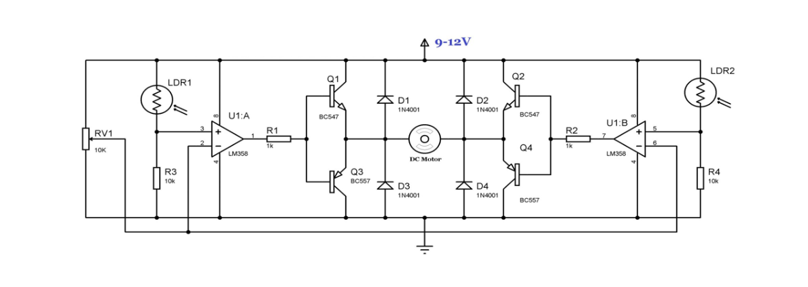
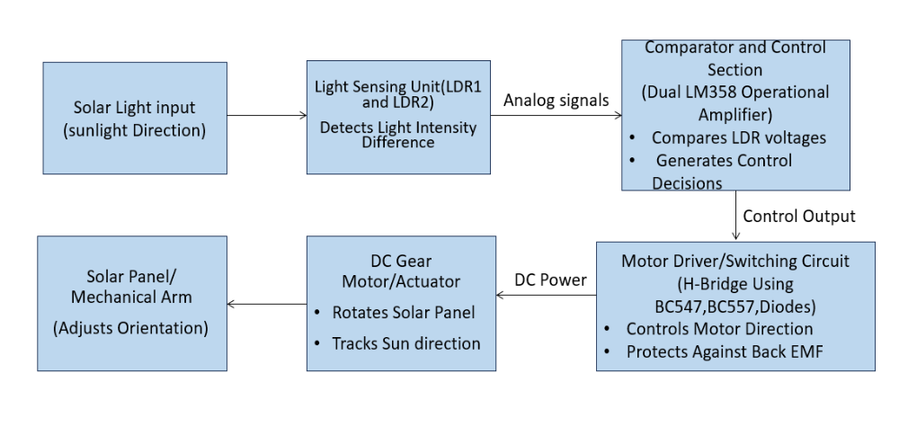
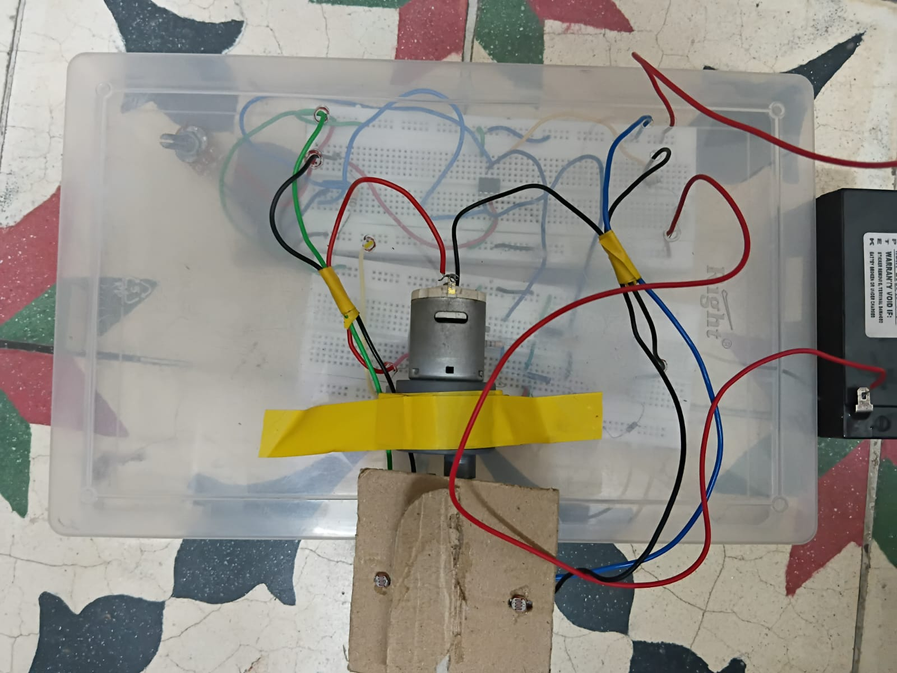
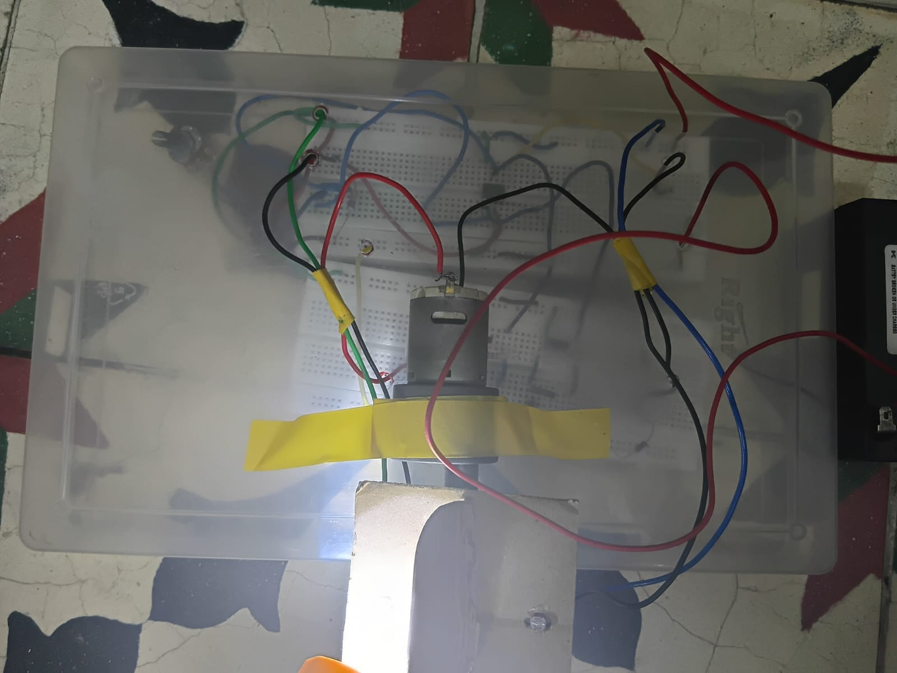
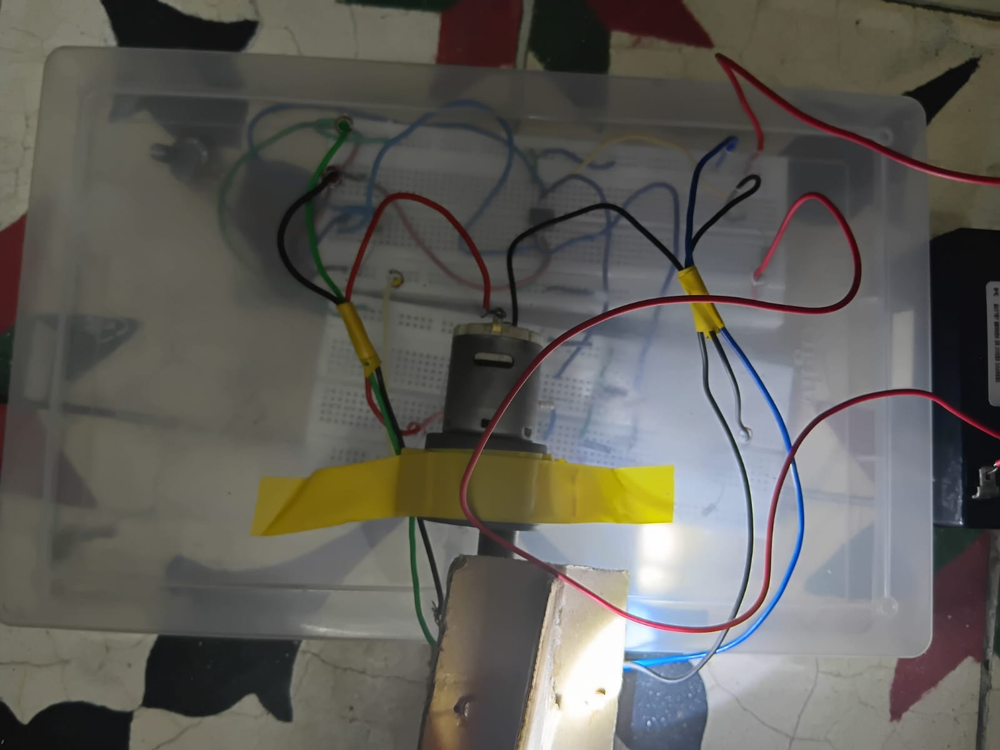

# Analog Single Axis Sun Tracker

## Overview
This project presents an Analog Single Axis Sun Tracker designed to improve solar energy absorption by automatically orienting a solar panel towards sunlight throughout the day. The system operates without a microcontroller and uses analog electronic circuitry for sun tracking and motor control.

The tracker detects the intensity difference of sunlight using Light Dependent Resistors (LDRs) and rotates the panel from east to west using a DC motor and H-Bridge driver mechanism.

## Features
- Automatic solar panel tracking
- Analog circuit-based operation
- Single-axis east-to-west rotation
- Increased solar energy efficiency
- Microcontroller-free design
- Real-time sunlight intensity comparison

## Components Used
- LDR Sensors
- Operational Amplifier
- H-Bridge Motor Driver Circuit
- DC Geared Motor
- Solar Panel
- Resistors
- Capacitors
- Transistors
- Power Supply Unit

## Working Principle
The system uses two LDR sensors placed on opposite sides of the solar panel to detect variations in sunlight intensity. The analog comparator circuit compares the sensor outputs and determines the direction of maximum light intensity.

Based on the comparator output, the H-Bridge driver rotates the DC motor either clockwise or anticlockwise, allowing the solar panel to align towards the sun automatically.

When both LDRs receive equal light intensity, the motor stops, maintaining the optimal panel position.

## Applications
- Solar Energy Harvesting Systems
- Smart Renewable Energy Solutions
- Automated Solar Panel Positioning
- Energy-Efficient Embedded Applications

## Advantages
- Low-cost implementation
- Reduced power consumption
- Simple analog design
- Improved solar panel efficiency
- No programming required

## Future Improvements
- Dual-axis sun tracking
- IoT-based performance monitoring
- Solar intensity data logging
- Automatic weather adaptation
- Battery charging integration

## Project Images

### Block Diagram

### Circuit Diagram

### Functional Block Diagram

### Initial Position
The solar panel remains in its default position when both LDR sensors receive nearly equal sunlight intensity.

### Left Rotation
When the left LDR receives higher sunlight intensity, the comparator circuit drives the motor to rotate the solar panel towards the left direction.

### Right Rotation
When the right LDR receives higher sunlight intensity, the H-Bridge driver rotates the motor towards the right direction for optimal sunlight alignment.

## Author
V.P. Siddeshwaran
B.E. Electronics and Communication Engineering
